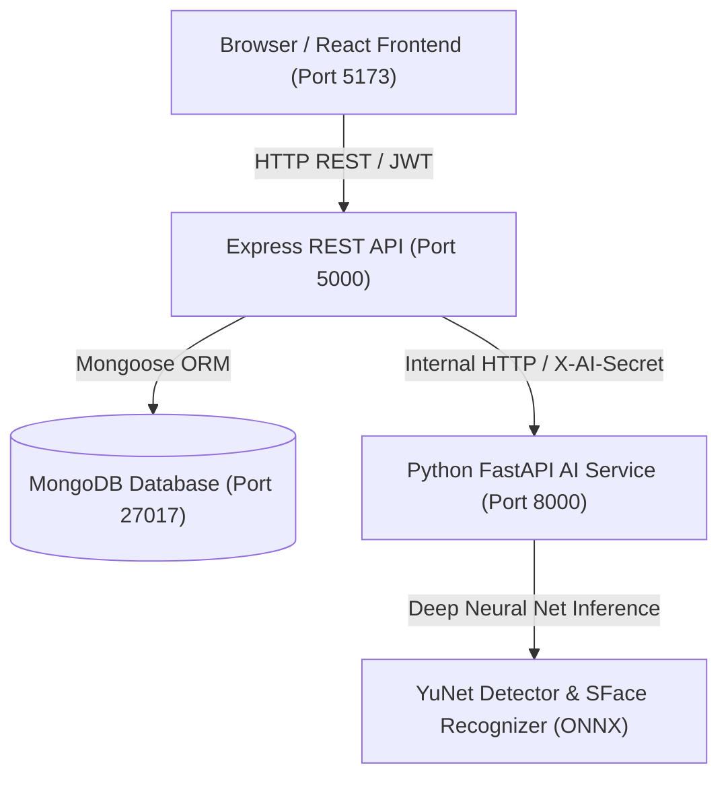
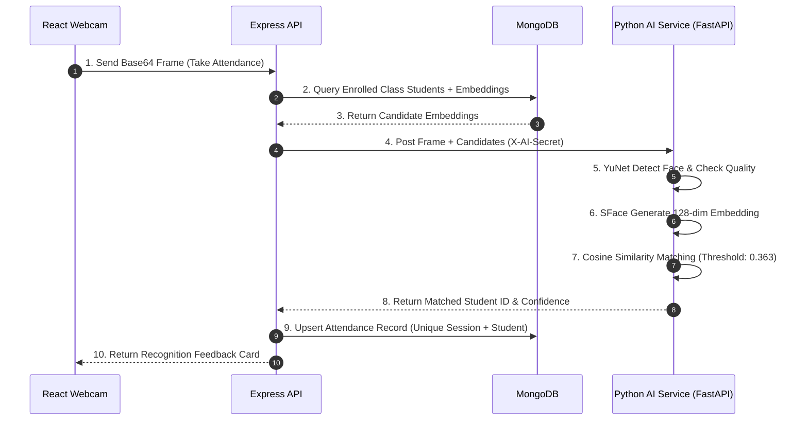

# System Architecture - SmartAttend AI

## Component Architecture Overview

SmartAttend AI adopts a decoupled 3-tier microservice architecture:

```mermaid
flowchart TD
    User["Browser / React Frontend (Port 5173)"]
    Express["Express REST API (Port 5000)"]
    Mongo[("MongoDB Database (Port 27017)")]
    FastAPI["Python FastAPI AI Service (Port 8000)"]
    OpenCV["YuNet Detector & SFace Recognizer (ONNX)"]

    User -->|HTTP REST / JWT| Express
    Express -->|Mongoose ORM| Mongo
    Express -->|Internal HTTP / X-AI-Secret| FastAPI
    FastAPI -->|Deep Neural Net Inference| OpenCV
```

## Face Recognition Pipeline Architecture

```mermaid
sequenceDiagram
    autonumber
    participant Browser as React Webcam
    participant API as Express API
    participant DB as MongoDB
    participant AI as Python AI Service (FastAPI)

    Browser->>API: 1. Send Base64 Frame (Take Attendance)
    API->>DB: 2. Query Enrolled Class Students + Embeddings
    DB-->>API: 3. Return Candidate Embeddings
    API->>AI: 4. Post Frame + Candidates (X-AI-Secret)
    AI->>AI: 5. YuNet Detect Face & Check Quality
    AI->>AI: 6. SFace Generate 128-dim Embedding
    AI->>AI: 7. Cosine Similarity Matching (Threshold: 0.363)
    AI-->>API: 8. Return Matched Student ID & Confidence
    API->>DB: 9. Upsert Attendance Record (Unique Session + Student)
    API-->>Browser: 10. Return Recognition Feedback Card
```
